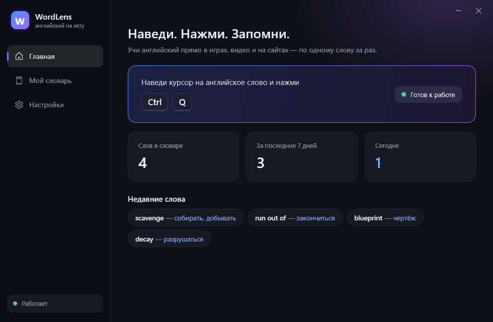
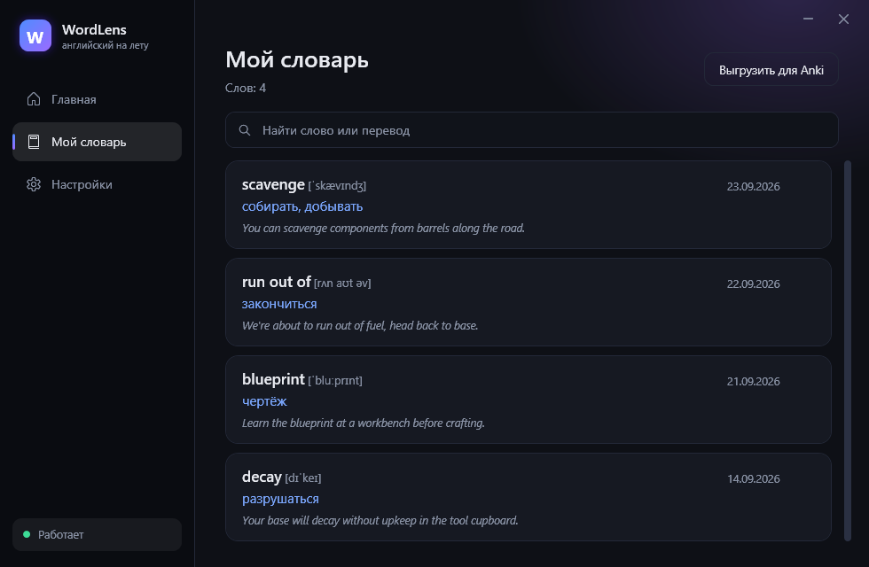
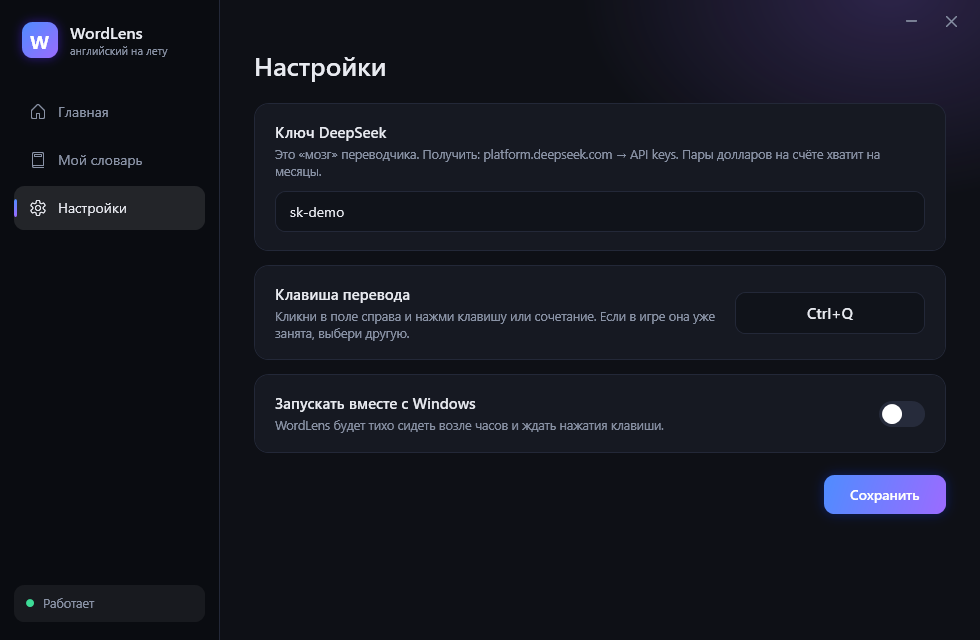

# WordLens

Наводишь курсор на английское слово в любом окне, жмёшь клавишу, рядом всплывает перевод этого слова **именно в этом предложении**: транскрипция, часть речи, фразовый глагол или идиома, если слово их часть, и короткое пояснение. Для тех, кто учит английский, а не переводит страницы целиком.

Point at any English word on screen, press a hotkey, get the word explained in its context. A Lookupper-style overlay for Windows, built for language learners.



## Что умеет

- **Одно слово.** Курсор на слово, короткое нажатие клавиши (по умолчанию `F8`). Перевод в контексте, начальная форма, IPA, часть речи, другие значения, фразовый глагол или идиома.
- **Фраза.** Зажал клавишу, повёл мышкой, слова подсвечиваются по ходу. Отпустил: перевод фразы, разбор 2–5 ключевых слов, заметка про грамматику.
- **Мой словарь.** Звёздочка сохраняет слово с контекстом. Список с датами, статистика на главной.
- **Озвучка** слова системным голосом Windows.
- Работает поверх игр в оконном или borderless-режиме, браузера, видео, любых программ.

## Как это устроено

| Часть | Чем сделано | Почему |
|---|---|---|
| Снимок экрана и распознавание | `Windows.Media.Ocr` (встроен в Windows 10/11) | Даёт координаты каждого слова, ничего скачивать не нужно |
| Горячая клавиша | `RegisterHotKey` | Без хуков клавиатуры и инъекций в чужие процессы, безопасно для античитов |
| Окна подсказок | WPF, `WS_EX_NOACTIVATE` | Не забирают фокус у игры или программы |
| Объяснение слова | DeepSeek `deepseek-chat`, ответ строго JSON | Понимает контекст, исправляет ошибки OCR по смыслу |
| Настройки и словарь | `%AppData%\WordLens\*.json` | Ключ API хранится только у пользователя |

Снимок делается один раз в момент нажатия, распознавание идёт по нему. Программа не читает память других процессов и не перехватывает ввод.

## Запуск

Нужны Windows 10 (19041) или 11, .NET 9 и английский язык распознавания в системе (Параметры → Время и язык → Язык → English → Распознавание текста).

```powershell
dotnet build -c Release
.\bin\Release\net9.0-windows10.0.19041.0\WordLens.exe
```

В настройках вставить ключ DeepSeek (platform.deepseek.com), при желании сменить клавишу.

Служебные режимы:

```powershell
WordLens.exe --selftest report.txt     # проверка OCR и жеста выделения без API
WordLens.exe --shots папка             # PNG всех страниц окна с демо-данными
```

## Скриншоты

| Мой словарь | Настройки |
|---|---|
|  |  |

## Ограничения

- Только Windows, только оконный или borderless-режим для игр (в эксклюзивном полноэкранном снимок экрана пустой).
- Качество распознавания зависит от шрифта: обычный текст читается уверенно, стилизованные игровые шрифты не всегда.
- Нужен собственный ключ DeepSeek, запросы платные (доли цента за слово).

## Планы

Экспорт в Anki, повторение слов внутри программы, автозапуск, сборка в один exe.
